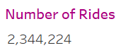
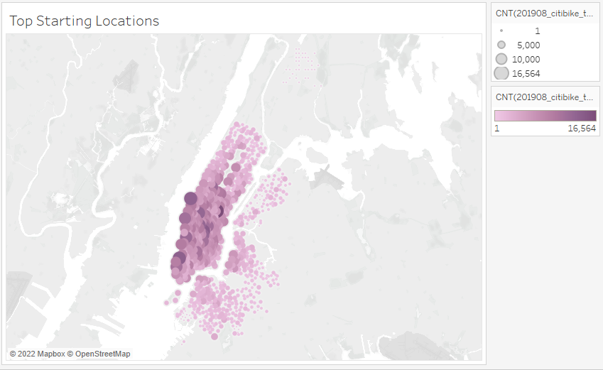
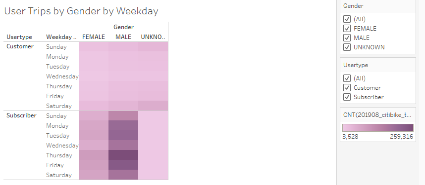
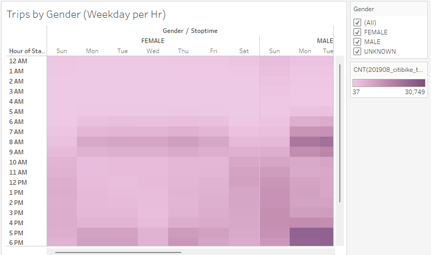
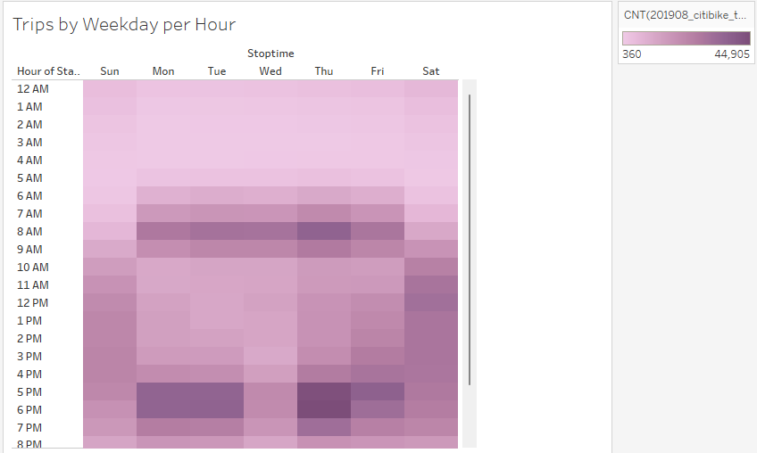
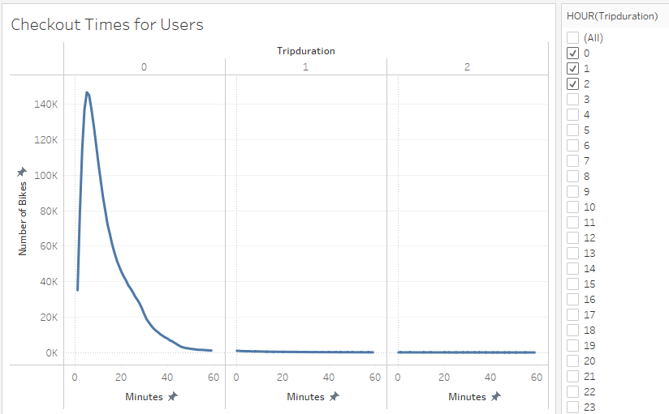
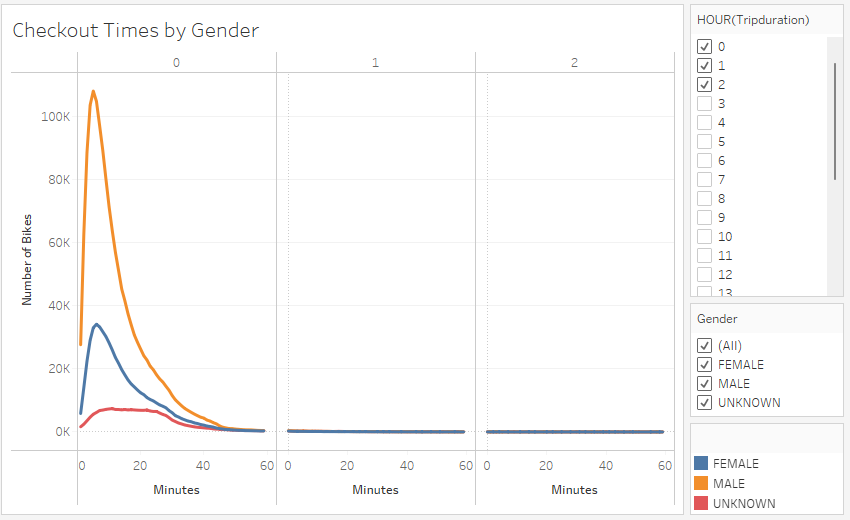

# Bike Sharing
##Overview of Analysis
###Purpose
The purpose of this project was to create graphical visualizations from the Citi Bike August 2019 dataset to draw several conclusions significant to potential investors.
[Link to Tableau Story](https://public.tableau.com/app/profile/myra.jacobs/viz/CityBikeSharing_16496405668640/CityBikeSharing?publish=yes)
###Background
This analysis uses Tableau to craft engaging and interactive charts Katie can use during presentations to potential investors in a business venture looking to expand bike sharing in Des Moines, Iowa..

## Results
### Number of Rides

This image shows the number of rides taken in August 2019 in NYC. With over 2 million users in one month alone, bike sharing has huge profit potential.

### Top Starting Location

The above image reveals a greater concentration of the top starting locations for bike sharing rides in Manhattan, NYC. This data suggests tourism may play a factor in where people are checking out bikes.

### Trips by Gender By Weekday

This image shows there is a significant concentration of male subscribers. This holds true throughout the week.

### Trips by Gender (Weekday per Hr)

The image above shows that the male customer base often has stop times in the evening.

### Trips by Weekday per Hour

This image shows stop times overall through the week have a somewhat heavier concentration in the evenings.

### Checkout Times for Users

Based on the image above, it appears a significant number of users checkout bikes for no more than an hour at a time.

### Checkout Times by Gender

Regardless of gender, based on the image above, a significant number of users checkout bikes for no more than an hour at a time.

## Summary
### Results in Brief
In conclusion, based on the results depicted in the images above, ride sharing offers huge investor potential in city settings, especially when appealing to a male customer base and having bike station placement in heavy tourism locations. 
### Recommendations
Two additional visualizations I would perform with the given dataset are:
- the number of trips by gender per hour based on start time
- the number of trips per weekday per hour based on start time

